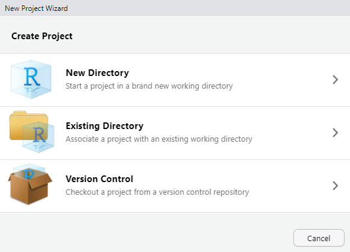
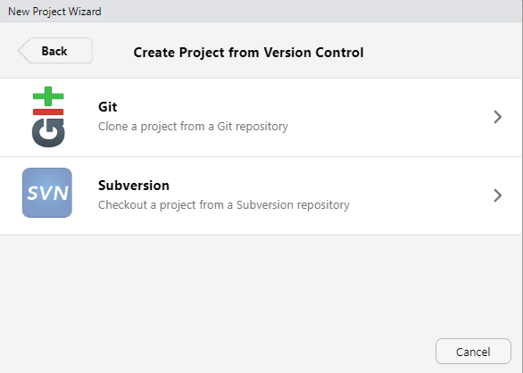
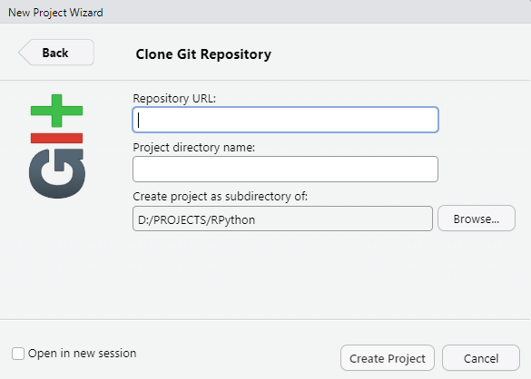

# Py-R Patent Analysis

Preprocess With Python, Analyze with R.

## SETUP

Rstudio에서, `file > New Project`를 선택합니다.



위와 같은 팝업이 뜨면, `Version Control`, `Git`을 순서대로 선택합니다.

| 버전관리                                      | Git                       |
| --------------------------------------------- | ------------------------- |
|  |  |

- `Repository URL` 칸에 이 레포지토리의 URL을 입력합니다.
- `Project directory name` 칸에 프로젝트 폴더의 이름을 입력합니다. 변경하지 않아도 됩니다.
- `Browse`버튼을 눌러 이 프로젝트 폴더가 생성될 경로를 선택합니다.
- `Open in new session` 체크박스를 체크하고, `Create Project` 버튼을 눌러 프로젝트를 생성합니다.

---

프로젝트가 성공적으로 생성되었다면, Rstudio 콘솔에서 다음 명령어를 실행합니다:

```R
install.packages(c("rmarkdown","knitr","renv"),prompt=FALSE)
```

  
모든 패키지가 설치되고 나면, [main.rmd](main.rmd)의 첫 번째 코드 셀을 실행하세요. 
해당 셀은 다음과 같습니다:

```R
{r renv Startup, echo=FALSE}
renv::activate()
```
이 셀은 R 가상환경을 활성화하고, R 엔진을 재시작합니다.
다음과 같은 메시지가 콘솔에 표시되었다면 R 엔진이 정상적으로 재시작된 것입니다.

```
Restarting R session...
- Project 'D:/your/path/here' loaded. [renv 1.1.5]
```

이제 두 번째 청크를 실행하십시오:

```r
{r renv Restore, include=FALSE}
renv::restore(prompt = FALSE)
```

이 청크는 [renv.lock](renv.lock)를 이용해 R 가상환경을 복원합니다.
기록된 모든 패키지가 설치되었다면, 이제 다음으로 진행해도 좋습니다.

# WARNING

- 파이썬 모듈을 변경한 후에는 R 엔진을 재시작해야만 변경 사항이 반영됩니다.
## WARNINGS

1. [`modules`](modules)폴더에 정의된 파이썬 모듈을 수정한 후 R에 반영하려면 R 엔진을 재시작해야 합니다.
